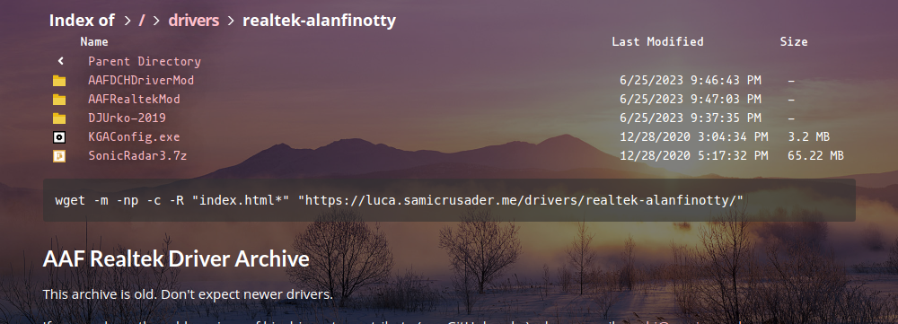

# Histoire

A beautiful file indexer written in Python with Quart.

## Features

* Customizable with theme support
* [Clickable breadcrumb](.github/breadcrumb.gif) (the "Index of" bar)
* Supports global and per-folder header and footer pages
* Cached, in-line and [expandable](.github/image_thumbnail.gif) image and video thumbnails
* [Embedded index thumbnails](.github/discord_embed.png)
* Allows in-browser playback of `.mov` and `.mkv` files with mimetype spoofing
* Still serves your files

## Installation

This should all be done within a container using either Docker or LXC with read-only access to your directory.

* Install `opencv2 wkhtmltopdf` from your system's repositories
  * Debian/Ubuntu users should replace `opencv2` with `libopencv-dev`
* Install `pydantic pydantic_settings aiofile aiopath av quart imgkit jinja2 markdown markupsafe opencv-python pillow yaml` to your Python installation
  * **FIXME: package names for Quart are likely wrong**
  * Arch Linux users should install `python-pydantic python-quart python-jinja2 python-markdown python-pillow python-av python-yaml`
  * Debian/Ubuntu users should install `python3-pydantic python3-quart python3-jinja2 python3-commonmark python3-markupsafe python3-av python3-yaml python3-pil`
  * `pydantic_settings aiofile aiopath imgkit` still needs to be installed from PyPI using `pip`
* Copy [`config.example.yaml`](config.example.yaml) to `config.yaml` in the same directory as [`app.py`](app.py) and edit to your liking
* **FIXME: uWSGI doesn't work for this anymore**
* ~~Copy [`uwsgi.ini`](uwsgi.ini) to `/etc/uwsgi/histoire.ini` and edit to your liking~~
* ~~Create the `thumbimage_cache_dir` as specified in `config.yaml` and the uwsgi socket directory as specified by `socket` in `/etc/uwsgi/histoire.ini` and set the permissions to the same user and group as specified in `/etc/uwsgi/histoire.ini`~~
* ~~Start `uwsgi@histoire.service` with `systemctl` or run `/usr/bin/uwsgi --ini /etc/uwsgi/histoire.ini` as a background process as `root`~~
* ~~Set your web server to pass the path you want for Histoire to run on using (u)WSGI to the UNIX socket file specified by `socket` in `/etc/uwsgi/histoire.ini`~~
  * ~~nginx users should use `include uwsgi_params; uwsgi_pass unix:/run/uwsgi/histoire.sock;`~~
